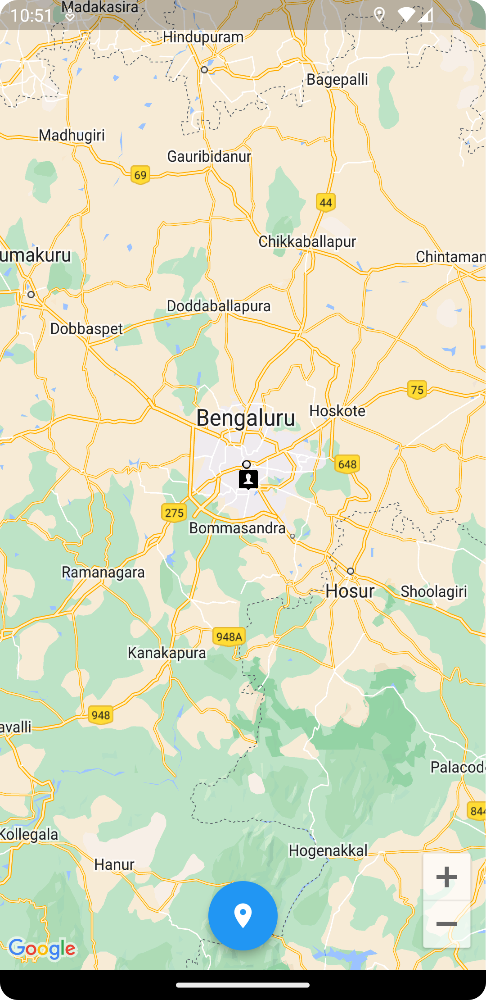
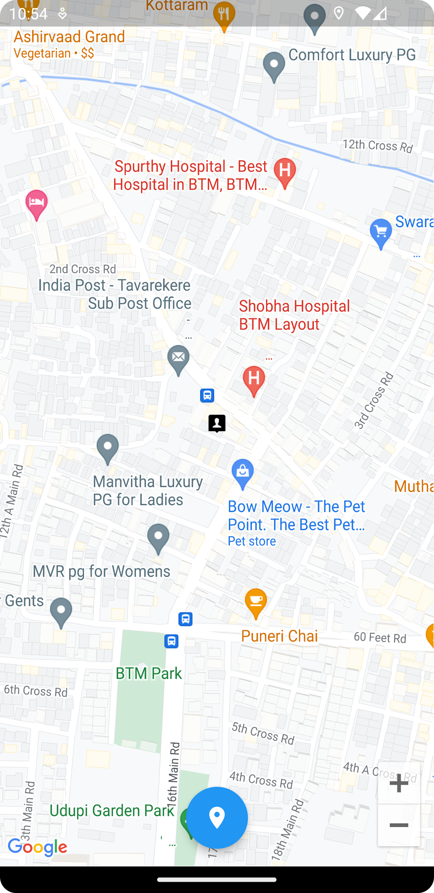

# FlutterGooglemapwithCurrentLocation

Google map and current Location find sample concept tried. if you want clone or fork it.


## FrameWork
1. Flutter

## Language:
1. Dart

## Tools:
1. Git
2. Android studio / Vscode

## Pre-requirement:
1. Flutter 3.3.10
2. Dart 2.18.6
3. google_maps_flutter: ^2.2.3
4. geolocator: ^9.0.2

# Cli command
## check your flutter support info:

```
flutter doctor
```
## dependancy install / package install:
```
flutter pub get
```
## Run methods:
```
flutter run
```
### ✌&ensp;Preview

|                 Preview                  |     Current Location Preview        |
|:-------------------------------------:|:--------------------------------------:|
|  |  |
